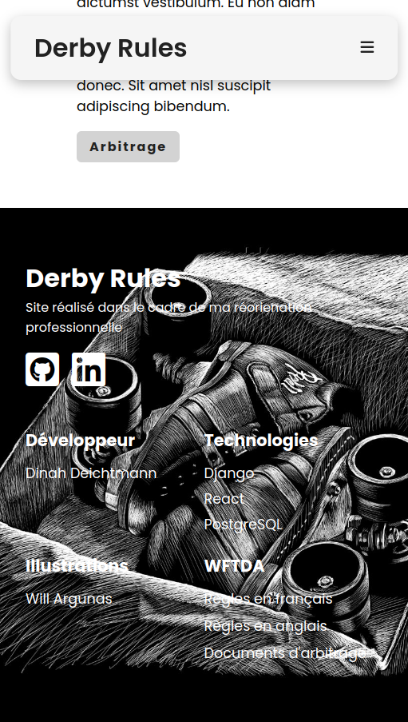

# Group project: fully responsive homepage

This homepage is part of a larger **group project** I, alongside three other student developers, **built from scratch** during my Continuing Education course at **Toulouse Institute of Technology**. Find the complete project [here](https://github.com/dinahdeichtmann/django_react_rollerderbyquiz).

During our three day long hackathon, I was initally tasked with a component dependent on another team member's work to be fully functional. Due to technical difficulties, that teammate was struggling. When it became apparent that they wouldn't be able to finish up in time for the presentation, I consulted with the team and made the decision to take on the homepage.

It ended up being the focus of our end-of-hackathon presentation, **gaining praise for my web design**. Even though the overall app is not as functional as we would have hoped, **our presentation was a success**. I'm glad that I could use **my ability to think quick on my feet and be proactive** to reevaluate my priorities and switch my focus to something that would be **valuable to the team**!

## Technologies

- React.js
- CSS

## Skills

- **Create, import, export and nest components**
- Use **dynamic properties** to display data
- **Share information between components** with **props**
- **Respond to and handle user events** with **event handlers**
- **Manage changing data** with the **useState hook**
- Use **Strict Mode** to **keep components pure**
- **Enhance the page's aesthetics** with **CSS animations**, **Font Awesome icons**, and **Google Fonts**

## Functionalities

- Fully responsive page
- Two responsive breakpoints (850px wide, 600px wide)
- Sticky navbar

## Smaller screen screenshots

