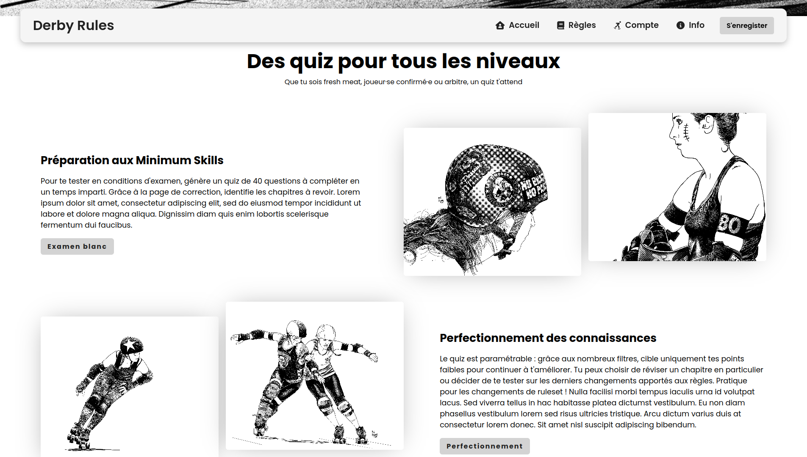
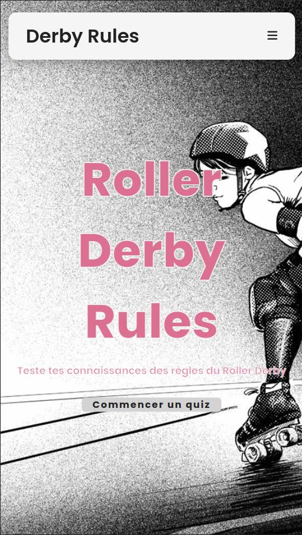
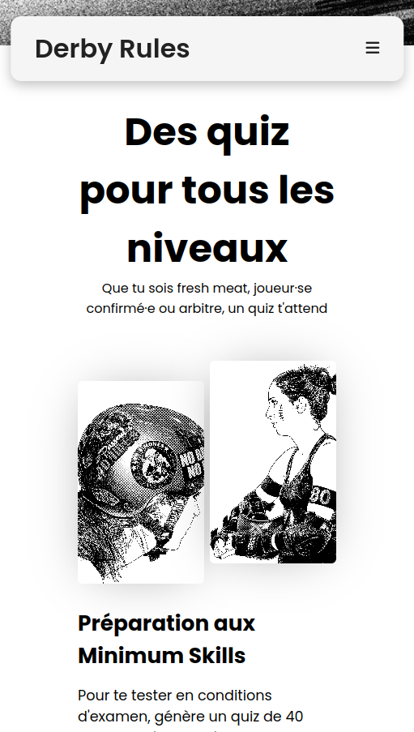

# Group project: fully responsive homepage

This homepage is part of a larger **group project** I, alongside three other student developers, **built from scratch** during my Continuing Education course at **Toulouse Institute of Technology**. Find the complete project [here](https://github.com/dinahdeichtmann/django_react_rollerderbyquiz).

This was my main front-end contribution to the project. I used React.js and CSS to design a sleek and stylish homepage. It is fully responsive and has different subtle animations.

## Technologies used

- React.js
- CSS

## Smaller screen (< 850 px) screenshots

